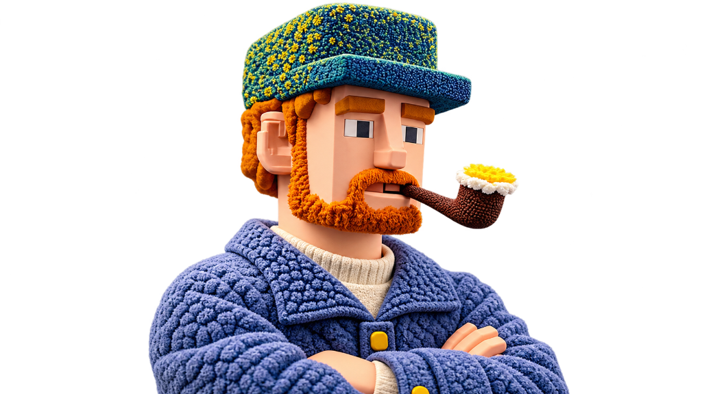
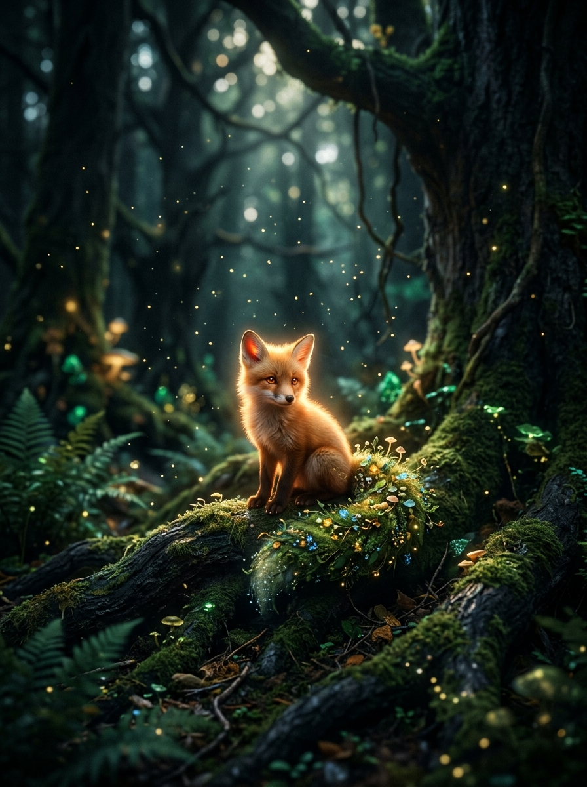
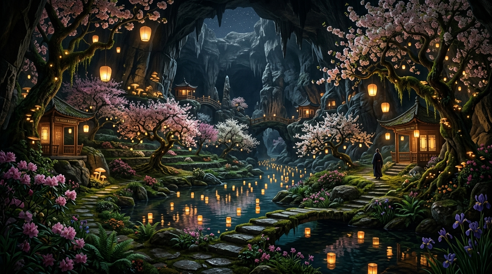
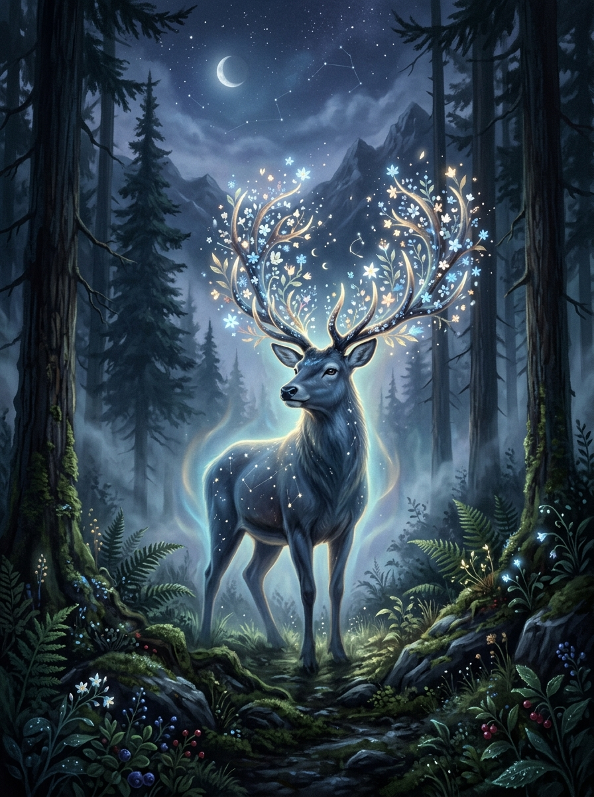
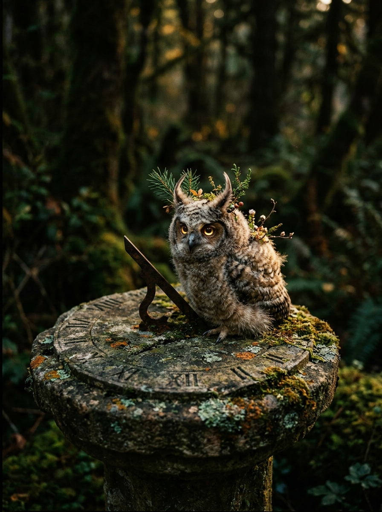
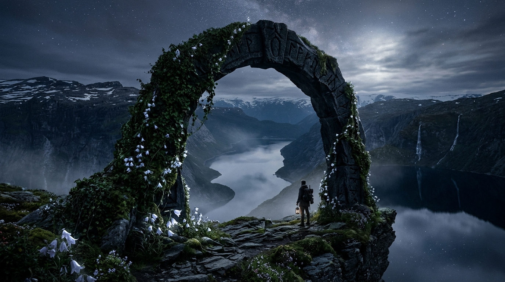

<div align="center">

# 🌿 F L O R I A
### *An Immersive 3D Chronicle of Curious Creatures, Secret Sanctuaries & Living Lore*

[](https://floria-explore.vercel.app)
[](https://nextjs.org/)
[](https://react.dev/)
[](https://threejs.org/)
[](https://motion.dev/)
[](https://tailwindcss.com/)

<p align="center">
  <a href="https://floria-explore.vercel.app"><strong>🌐 Explore Live Site</strong></a> •
  <a href="#-overview"><strong>📖 Overview</strong></a> •
  <a href="#-the-3d-model"><strong>🎨 3D Piper Centerpiece</strong></a> •
  <a href="#-key-features"><strong>✨ Key Features</strong></a> •
  <a href="#-tech-stack--architecture"><strong>⚙️ Architecture</strong></a> •
  <a href="#-getting-started"><strong>🚀 Getting Started</strong></a>
</p>

---

</div>

<br />

## 🌟 The 3D Piper Centerpiece

<div align="center">
  
  <p><em>"The Piper of the Groves" — Interactive Three.js WebGL model featuring real-time eye & head cursor tracking, custom vertex shader neck articulation, ACESFilmic tone mapping, and intelligent off-screen GPU culling.</em></p>
</div>

<br />

---

## 📖 Overview

**FLORIA** is an award-winning editorial web experience created at the intersection of high fashion monographs, folklore field journals, and cutting-edge interactive 3D web technology. 

Designed on a pure obsidian black canvas, **FLORIA** transports wanderers into an untouched botanical world where:
- A stylized **3D character** watches and reacts fluidly to your cursor in real time.
- A **cursor spotlight lens** peels back daytime landscapes to reveal radiant moonlit secret worlds.
- A **scroll-driven cinematic storytelling section** expands seamlessly from a vertical 9:16 portrait card into an edge-to-edge full-screen panorama powered by **Framer Motion**.
- An **asymmetric digital archives grid** catalogues rare mythical creatures and sacred architecture with interactive inspection states.

---

## ✨ Key Features

### 1. 🎭 Interactive 3D WebGL Character Centerpiece
- **Dynamic Cursor Tracking:** Three.js perspective camera and custom head rotation uniforms track pointer movement with smooth lerp physics.
- **Selective Vertex Shading:** Custom GLSL vertex shader hook (`smoothstep(0.36, 0.52)`) articulates the head, cap, and pipe while preserving a solid grounded base.
- **Studio Lighting Rig:** Dual directional key and cool rim lights paired with a warm point light that radiates an amber glow from the smoking pipe.
- **Smart GPU Resource Culling:** Utilizes `IntersectionObserver` to halt the WebGL `requestAnimationFrame` render loop whenever the hero is offscreen, conserving 100% of GPU/CPU fill-rate for subsequent sections.

### 2. ⚡ Lag-Free Framer Motion Story Engine
- **Compositor-Driven Scroll Physics:** Uses Framer Motion's `useScroll`, `useSpring({ stiffness: 90, damping: 22 })`, and `useTransform` MotionValues.
- **Zero React Re-Renders:** Bypasses React's virtual DOM reconciliation loop during scrolling. Transforms (`scale`, `translate3d`, `opacity`, `border-radius`) update directly on the browser's hardware-accelerated compositor thread.
- **Editorial Typography Transitions:** 6 asymmetric editorial pull-quotes and field journal stamps float and disperse with staggered departures as the user immerses into the scenery.

### 3. 🔍 Zero-State Dual-Realm Cursor Spotlight
- **Interactive Lens:** Reveals an alternate moonlit night realm hidden beneath the daylight scene through a soft 260px feathered spotlight.
- **Direct DOM Mutation:** Operates without React state re-renders via direct ref styling (`mask-image`, `webkit-mask-image`), sustaining a silky 120 FPS cursor experience.
- **Realm Switcher:** Switch between the Daytime River (`BG_IMAGE_1`), the Moonlit Realm (`BG_IMAGE_2`), and Pure Editorial Black anytime.

### 4. 📜 Curated Digital Specimen Archive
- **Asymmetric Editorial Layout:** Non-uniform card dimensions and positions mimicking a museum monograph.
- **Interactive Micro-Interactions:** Cards tilt, elevate (`y: -8px`, `scale: 1.015`), and glow with golden borders upon hover.
- **Field Journal Metadata:** Displays scientific binomial names, sector coordinates, and elevation readings for each documented specimen.

---

## 🖼️ Gallery & Curated Realms

| Specimen / Sanctuary | Category | Description |
| :--- | :--- | :--- |
|  <br /> **The Ember Fox** | *Forest Spirit Fauna* | Observed resting upon ancient cedar roots at twilight. Tail emits a steady 420nm spore drift. |
|  <br /> **The Sunken Orchard** | *Subterranean Botanical* | Subterranean cherry blossoms blooming in caverns where floating water lanterns guide travelers. |
|  <br /> **The Celestial Stag** | *Celestial Ungulate* | Flowering antlers bloom beneath waxing crescents, depositing luminous star-moss upon each step. |
|  <br /> **The Sundial Owlet** | *Avian Botanical* | Perches upon weathered stone sundials along northern ridges, attuned to solar declinations. |
|  <br /> **The Obsidian Threshold** | *Monolithic Passage* | Colossal basalt archway hanging above glacial fjords, inscribed with archaic botanical sigils. |

---

## ⚙️ Tech Stack & Architecture

```
floria-website/
├── app/
│   ├── globals.css              # Editorial typography, gradients & smooth scroll styles
│   ├── layout.tsx               # Cinzel, Cormorant Garamond & Geist typography setup
│   └── page.tsx                 # Root layout assembling Hero, Story, Discovery & Footer
├── components/
│   ├── Character3D.tsx          # Three.js 3D character with vertex shader head-tracking & culling
│   ├── CursorReveal.tsx         # GPU-accelerated cursor spotlight lens (zero re-render)
│   ├── Hero.tsx                 # Dominant typography, issue stamps & spring CTA buttons
│   ├── StorySection.tsx         # Framer Motion scroll-driven expanding 9:16 storytelling section
│   ├── DiscoverySection.tsx     # Asymmetric digital specimen archive with whileInView physics
│   ├── BottomBar.tsx            # Realm switcher (Daytime / Moonlit / Black) & edition tags
│   ├── Navbar.tsx               # Minimalist editorial header with four-dot brandmark
│   ├── Modal.tsx                # AnimatePresence modal for compendiums and manifestos
│   └── Footer.tsx               # Art-book colophon, dispatches & monumental typography
├── public/
│   ├── 3D-model/                # Optimized GLTF stylized character model
│   ├── hero-character.png       # High-res 3D piper showcase image
│   ├── village_realm.jpg        # Cinematic sanctuary expansion artwork
│   └── discovery_*.jpg          # Curated fantasy wildlife & environment photography
├── tailwind.config.ts           # Extended themes, custom typography & color palettes
└── package.json                 # Next.js 16, React 19, Three.js, Framer Motion
```

### Technology Highlights
- **Framework:** [Next.js 16.4](https://nextjs.org/) with App Router and **Turbopack**
- **UI Library:** [React 19](https://react.dev/)
- **Animation Engine:** [Framer Motion 12](https://motion.dev/) (GPU-accelerated MotionValues & springs)
- **3D Graphics:** [Three.js](https://threejs.org/) (Custom Shaders, GLTF Loader, ACESFilmic Tone Mapping)
- **Styling:** [Tailwind CSS](https://tailwindcss.com/) with Vanilla CSS custom design tokens
- **Typography:** Google Fonts (*Cinzel*, *Cormorant Garamond*) and Vercel *Geist Mono*
- **Deployment:** [Vercel](https://vercel.com/) Edge Network

---

## 🚀 Getting Started

### Prerequisites
- **Node.js** >= 20.9.0 (Recommended: Node 22 or 24)
- **npm**, **pnpm**, or **yarn**

### Installation

1. **Clone the Repository:**
   ```bash
   git clone https://github.com/juzer09jawadwala-source/floria-explore.git
   cd floria-explore
   ```

2. **Install Dependencies:**
   ```bash
   npm install
   ```

3. **Run Development Server:**
   ```bash
   npm run dev
   ```

4. **Open in Browser:**
   Navigate to [http://localhost:3000](http://localhost:3000) to explore the application locally.

### Production Build & Verification

```bash
# Verify TypeScript types
npx tsc --noEmit

# Compile production bundle with Turbopack
npm run build

# Preview production build locally
npm run start
```

---

## 🌐 Deployment

The project is continuously deployed to **Vercel**:

- **Production URL:** [https://floria-explore.vercel.app](https://floria-explore.vercel.app)
- **Automatic CI/CD:** Every push to `main` triggers a production build and deployment via Vercel GitHub integration.

To deploy your own copy to Vercel:
```bash
npx vercel
```

---

## 📜 License & Credits

- **Design & Code:** Curated for the **FLORIA Digital Exploration Project**.
- **License:** Distributed under the [MIT License](LICENSE).
- **Inspiration:** Monograph field journals, Studio Ghibli landscapes, and avant-garde editorial exhibitions.

<div align="center">
  <br />
  <p><em>“Leave no traces except quiet contemplation. What is discovered here remains untamed.”</em></p>
  <sub>THE LIVING CHRONICLES · VOLUME 01 · MMXXIV</sub>
</div>
